# 모루 공용 컴포넌트 미리보기

이 문서는 Figma에 있는 공용 UI가 SwiftUI 코드에서 어떤 이름으로 만들어졌는지 보여주는 문서입니다.

화면을 만들 때는 먼저 여기에서 비슷한 UI를 찾아보고, 있으면 그대로 가져다 쓰면 됩니다.

컴포넌트 코드는 여기에 있습니다.

```text
Moru/DesignSystem/Components
```

## 어디를 보고 만든 건가요?

Figma `Hi-fi` 페이지의 왼쪽에 있는 `컴포넌트` 영역을 기준으로 만들었습니다.

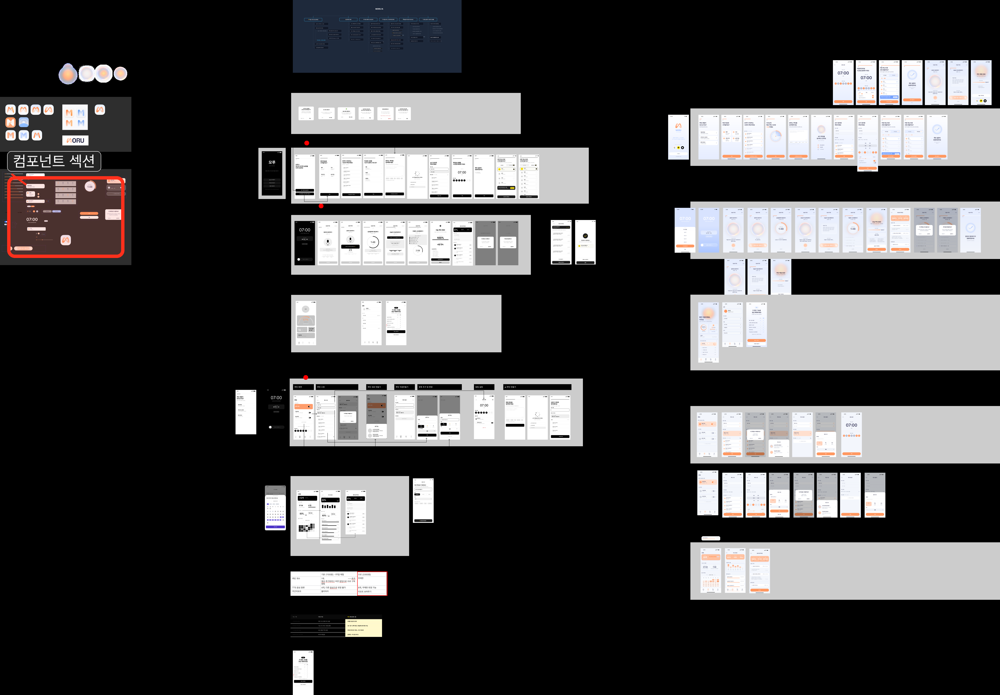

## 사용 규칙

1. 같은 UI가 있으면 표에 적힌 SwiftUI 컴포넌트를 사용합니다.
2. 없는 UI는 각자 feature 안에 먼저 만들고, 여러 번 반복되면 공용으로 옮깁니다.
3. 색상, 폰트, 간격, radius는 직접 쓰지 말고 `AppColor`, `AppFont`, `AppSpacing`, `AppRadius`를 사용합니다.
4. 아이콘, 로고, iPhone 상태바는 공용 View로 만들지 않습니다.

## Figma UI와 SwiftUI 이름

| Figma에서 보이는 UI | Figma 이름 | SwiftUI에서 쓸 이름 |
| --- | --- | --- |
| 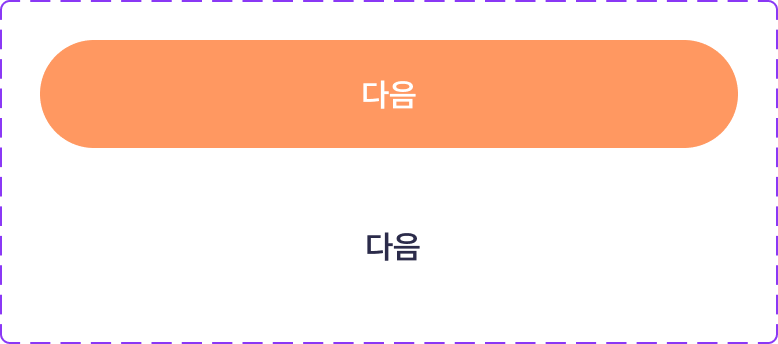 | `Text_Btn` | `MoruButton` |
| 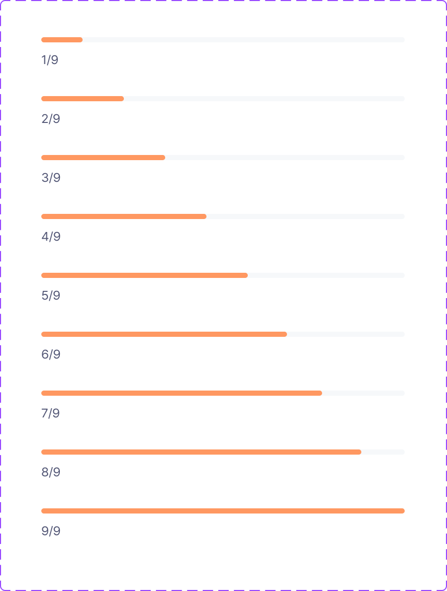 | `gage bar` | `MoruProgressBar` |
| 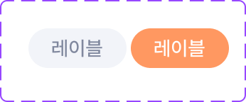 | `keyword` | `MoruChip` |
| 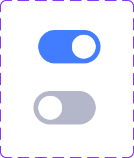 | `toggle` | `MoruToggle` |
| 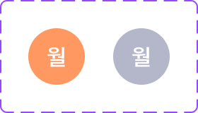 | `요일` | `MoruWeekdaySelector` |
| 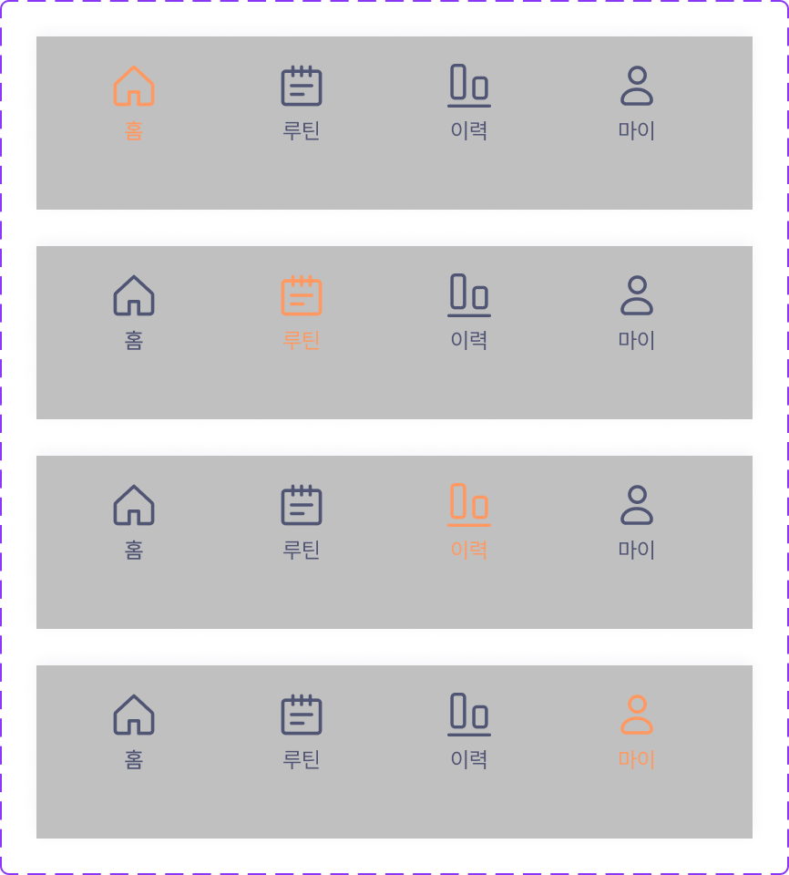 | `navi_bar` | `MoruTabBar` |
|  | `check` | `MoruCheckBadge` |
| 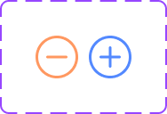 | `select` | `MoruSelectControl` |
| 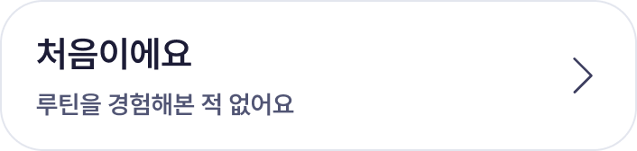 | `Frame 2147239094` | `MoruSelectionCard` |
| 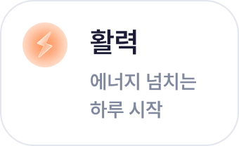 | `Frame 2147239102` | `MoruSelectionCard` |
| 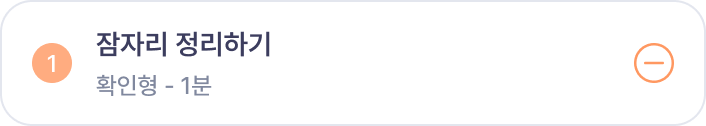 | `Frame 2147239112` | `MoruRoutineStepRow` |
| 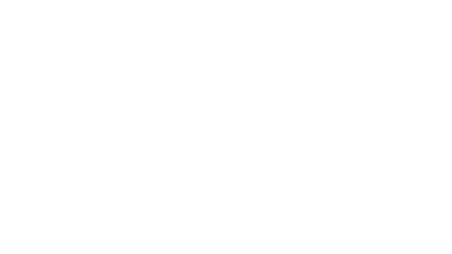 | `Time setting` | `MoruTimeSettingCard` |
| 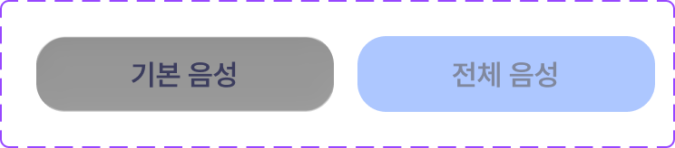 | `음성 선택` | `MoruVoiceCard` |
|  | `Frame 2147239165` | `MoruVoiceCard` |
| 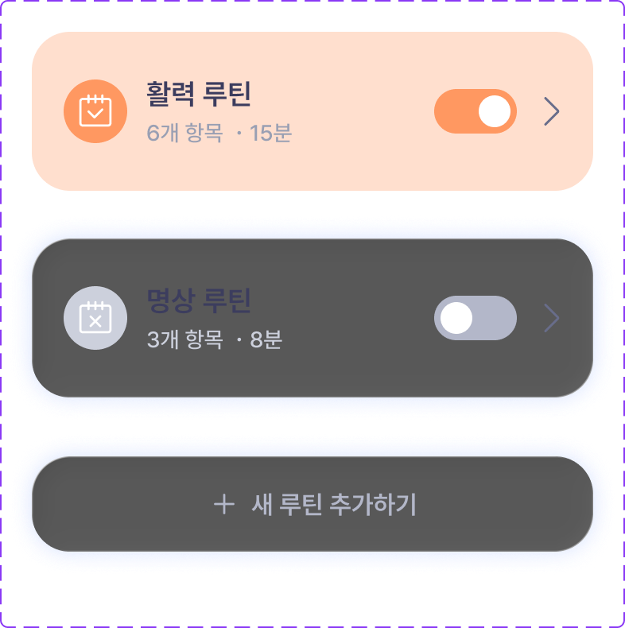 | `Component 3` | `MoruRoutineCard` |
| 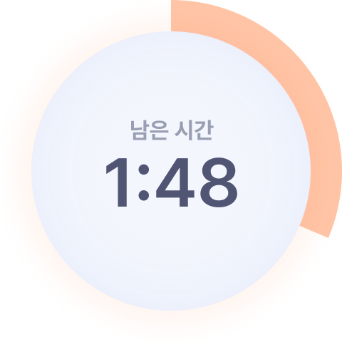 | `Frame 2147224501` | `MoruTimerStatus` |
|  | `Recoarding/End` | `MoruRecordingStatus` |
|  | `sound_module` | `MoruSoundModule` |
| 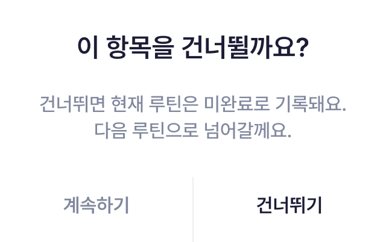 | 와이어프레임 팝업 | `MoruDialog` |

## Figma 컴포넌트에는 없지만 추가한 것

화면에서 자주 반복될 것 같아서 추가한 공용 컴포넌트입니다.

| SwiftUI 이름 | 용도 |
| --- | --- |
| `MoruCard` | 흰색 카드 박스 |
| `MoruBottomCTA` | 화면 하단 버튼 영역 |
| `MoruDialog` | 확인 팝업 |

## 만들지 않은 것

아래 항목은 공용 View로 만들지 않습니다.

| Figma 이름 | 이유 |
| --- | --- |
| `Status bar - iPhone` | 실제 앱에서는 iOS가 알아서 보여줍니다. |
| `logo` | 컴포넌트가 아니라 브랜드 이미지로 관리합니다. |
| `simple-line-icons:arrow-left` | 단독 아이콘입니다. |
| `simple-line-icons:check` | 단독 아이콘입니다. |
| `material-symbols-light:arrow-back-ios-rounded` | 단독 아이콘입니다. |
| `sound` | 단독 아이콘입니다. |
| `fire_icon` | 단독 아이콘입니다. |

## v1.0에서 주의할 점

v1.0은 서버 없이 로컬에서 돌아가는 앱으로 만듭니다. 그래서 아래 UI는 지금은 만들지 않거나 문구를 바꿉니다.

| Figma에 있는 표현 | v1.0에서는 |
| --- | --- |
| 소셜 로그인 버튼 | v2.0 이후로 미룹니다. |
| PRO / Paywall | v2.0 이후로 미룹니다. |
| AI가 분석하고 있어요 | 루틴을 정리하고 있어요 |
| AI 추천 루틴 | 추천 루틴 |
| AI 음성 안내 | 음성 안내 |
